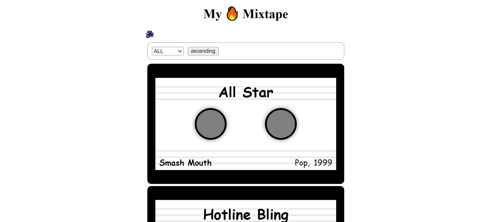

<h2 align="center"> REACT CONTEXT</h2>

> <h4>Context Meaning</h4>

- <p>In a typical React application, data is passed from parent to child components via props (commonly known s prop drilling), but such usage can be cumbersome for certain types of props that are required by many components within an application. <b><em>Context provides a way to share values like these between components without having to explicitly pass a prop through every level of the tree.</em></b></p>

<h3 align="center">Mixtape Repo</h3>

- <p>This simple single page REACT project is the complete step by step beginner's guide on how to use React Context!</p> 

<details>
  <summary>What you'll learn from this simple repo:</summary>
  <ol>
    <li>How to avoid prop drilling by using React Contexts</li>
    <li>Creating Context objects using <code>createContext()</code></li>
    <li>How to use the <code>useContext()</code> hook inside child components for the props to be available to them.</li>
    <li>Updating the context value in descendant React components</li>
    <li>Structuring nested providers for the same type of context</li>
 </ol>
</details>
<details>
  <summary>Snippet</summary>
  
</details>

<details>
  <summary>
  <b>NOTE!!</b>
  </summary>
  <p>Keep in mind, too, that Context is not always the best solution for your application’s architecture. There are other ways to handle state such as Redux, useReducer, or just useState and prop drilling (which isn’t always a problem)</p>
  <p>It’s best used sparingly and only for prop drilled values that don’t change very frequently.</p>
</details>

><h4>Mixtape Repo Structure</h4>

<p>I kept the structure of the React project simple for learning purposes</p>

<details>
  <summary>
    <h5>Cloning and starting the Repo</h5>
  </summary>

  ```jsx

  git clone {url of the repository}
  cd mixtape
  npm install
  npm start
  ```
</details>

<details>
  <summary>Folder structure</summary>
  <p>Inside the root directory (mixtape), you can see a <code>public</code> folder and a <code>src</code> folder and a <code>node modules</code> folder after install the dependacies required, we'll be dealing with the <code>src</code> folder for now.</p>
  <p>The <code>src</code> folder has the main components needed for the project</p>

  <details>
    <summary>
      <code>src</code> folder
    </summary>
    <code>Controls.js</code>
    <code>MixtapeApp.js</code>
    <code>MixtapeContext.js</code>
    <code>Songs.js</code>
    <code>SongList.js</code>
  </details>

</details>

<details>

  <summary>

  ><p>Explanation of the codes written in each and every folder, try to follow/code along as you learn. Refer the codes above(in the src folder) to find the exact codes.</p>
  </summary>
  <details>
    <summary>
    <p><code>MixtapeContext</code>Folder</p>
    </summary>
    <p>This is the main Context API Folder(where the magic happens).</p>
    <p>React, useState and createContext are imported at the top because they'll be of use.</p>
    <p>A context object name MixtapeContext(can be named anyhow because it's a variable name) is created using <code>createContext()</code> API. which returns a 
    Provider which will be used further</p>
    <p>A MixtapeProvider function is created right after the context object, the function will be the main feature which will be the provider of the props in our         project, it takes in two parameters <code>children</code> and <code>songs</code></p>
    <p></p>
    <p>The <code>children</code> will allow the provider to pass in props nested inside the context Provider</p>
  </details>
</details>


